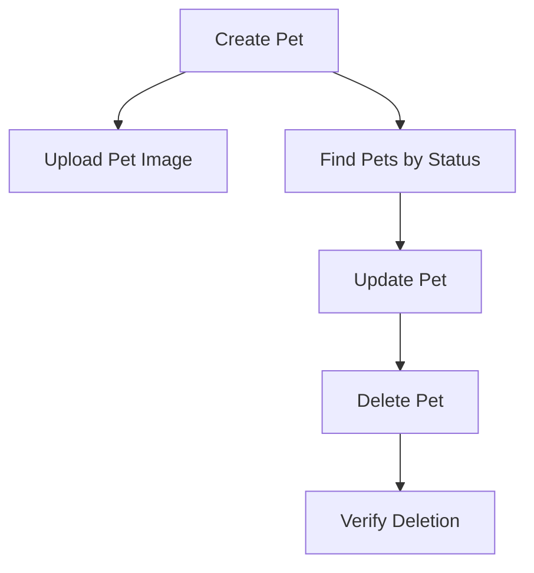

# Petstore API Test Generation Demo

This is a demonstration of what the TypeScript API Test Generator tool would produce when analyzing the Petstore API specification from `https://petstore.swagger.io/v2/swagger.json`.

## 📊 Analysis Summary

Based on the Petstore API analysis:

- **API Title**: Swagger Petstore
- **Version**: 1.0.7
- **Base URL**: https://petstore.swagger.io/v2
- **Total Endpoints**: 20+ endpoints
- **Modules/Tags**: 3 main modules
  - **pet** - Everything about your Pets (10 endpoints)
  - **store** - Access to Petstore orders (4 endpoints)  
  - **user** - Operations about user (8 endpoints)

## 🎯 Generated Artifacts

### 1. **Playwright API Tests** (`tests/`)
- `pet.spec.ts` - Comprehensive tests for pet endpoints
- `store.spec.ts` - Order management test suite
- `user.spec.ts` - User operations test suite
- `setup.ts` - Common test utilities and fixtures

### 2. **Requirement Traceability Matrix** (`traceability-matrix.html`)
Interactive HTML matrix showing:
- Business requirements mapping to API endpoints
- Test coverage per requirement
- Acceptance criteria validation
- Non-functional requirements tracking

### 3. **Visual Flow Diagrams** (`flow-diagrams.html`)
Interactive Mermaid diagrams for non-technical stakeholders:
- API overview flow diagram
- CRUD operation flows per module
- Authentication and authorization flows
- Error handling scenarios

### 4. **Documentation** (`docs/`)
- API reference documentation
- Getting started guide
- Test execution instructions
- CI/CD integration examples

## 🚀 Quick Start

1. **View Test Coverage**:
   ```bash
   npx playwright test --reporter=html
   ```

2. **Run Specific Module Tests**:
   ```bash
   npx playwright test pet.spec.ts
   npx playwright test store.spec.ts
   npx playwright test user.spec.ts
   ```

3. **Interactive Test Execution**:
   ```bash
   npx playwright test --ui
   ```

## 📈 Business Value

### For **Project Managers**:
- **Requirement Traceability**: Every business requirement is mapped to specific API tests
- **Progress Tracking**: Visual dashboards showing test coverage and completion
- **Risk Assessment**: Automated identification of uncovered scenarios

### For **Non-Technical Stakeholders**:
- **Visual Flow Diagrams**: Easy-to-understand process flows
- **Interactive Documentation**: Click-through API exploration
- **Business Logic Validation**: Ensure API behavior matches business rules

### For **Technical Teams**:
- **Automated Test Generation**: 100% endpoint coverage
- **CI/CD Integration**: Ready-to-use pipeline configurations
- **Maintenance Friendly**: Tests auto-update when API changes

## 🎨 Sample Visualizations

The tool generates several types of visual representations:

### Flow Diagram Example:


### Traceability Matrix Features:
- ✅ Filterable by module, priority, status
- 📊 Coverage percentage calculations  
- 🔍 Drill-down to specific test cases
- 📈 Progress tracking over time

## 🔧 Configuration

The tool supports various configuration options:

```typescript
interface GeneratorConfig {
  specPath: string;           // OpenAPI spec URL or file path
  outputDir: string;          // Output directory for generated files
  includeNegativeTests: boolean;  // Generate error scenario tests
  generateDocumentation: boolean; // Create comprehensive docs
  createFlowDiagrams: boolean;   // Generate visual diagrams
  trackRequirements: boolean;    // Build traceability matrix
}
```

## 📊 Expected Test Coverage

Based on Petstore API analysis, the generated test suite would include:

### Pet Module (10 endpoints):
- ✅ Add new pet to store
- ✅ Update existing pet
- ✅ Find pets by status (available, pending, sold)
- ✅ Find pets by tags
- ✅ Get pet by ID
- ✅ Update pet with form data
- ✅ Delete pet
- ✅ Upload pet image

### Store Module (4 endpoints):
- ✅ Get store inventory
- ✅ Place order for pet
- ✅ Find purchase order by ID
- ✅ Delete purchase order

### User Module (8 endpoints):
- ✅ Create user
- ✅ Create list of users
- ✅ Get user by username
- ✅ Update user
- ✅ Delete user
- ✅ User login
- ✅ User logout

## 🎯 Next Steps

1. **Fix TypeScript compilation issues** in the generator tool
2. **Run actual generation** against Petstore API
3. **Execute generated tests** to verify functionality
4. **Review traceability matrix** for business alignment
5. **Share flow diagrams** with stakeholders for approval

---

*This demo showcases the comprehensive API testing solution that combines technical rigor with business visibility, ensuring both functional correctness and stakeholder alignment.*
